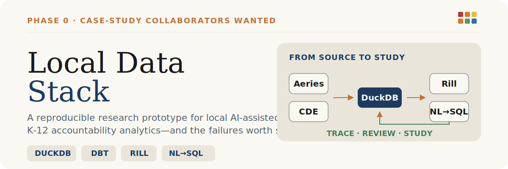
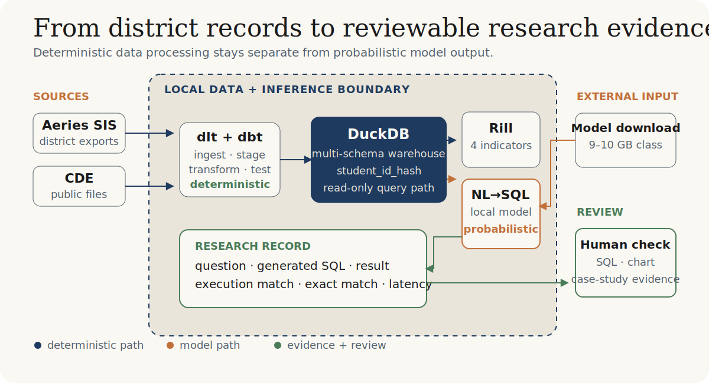

<p align="center">
  
</p>

<p align="center">
  <a href="https://research.lucidotechnologyconsulting.com/overview.html">Research overview</a> ·
  <a href="https://huggingface.co/datasets/KDDSTLC/lfed-training-data">Training data</a> ·
  <a href="https://huggingface.co/KDDSTLC/lfed-qwen2.5-coder-14b-sql-lora-warehouse-r64">r=64 model</a> ·
  <a href="https://huggingface.co/spaces/KDDSTLC/LFED">Live demo</a> ·
  <a href="#reproduce-locally">Reproduce locally</a>
</p>

> [!IMPORTANT]
> **Research status:** Local Data Stack (LFED) is a working research prototype in Phase 0—case-study preparation and collaborator search. The software artifacts are public; the district case study and K12-Bench study are planned. This repository is not presented as production-ready school software.

## The research case

Open K-12 analytics systems are difficult to study because district data is private, source systems are fragmented, and accountability metrics contain state-specific semantics. Local Data Stack provides an inspectable artifact for asking a narrower question: what changes when district administrators can query accountability data through an open, local-first stack—and where do the language-model components fail?

The first study is organized around three research questions:

1. **Adoption:** How do district administrators use a natural-language query layer to investigate accountability data?
2. **Failure modes:** Which accountability-semantic questions fail, and how do users detect or recover from plausible but incorrect SQL?
3. **Equity of access:** Does open-source natural-language tooling change who can ask district data questions?

Read the [60-second overview](https://research.lucidotechnologyconsulting.com/overview.html), [visual explainer](https://research.lucidotechnologyconsulting.com/explainer.html), [research synthesis](https://research.lucidotechnologyconsulting.com/synthesis.html), and [strategic pressures](https://research.lucidotechnologyconsulting.com/strategic-pressures.html).

## How the research artifact works

<p align="center">
  
</p>

- **Sources:** Aeries SIS exports and California Department of Education public files.
- **Deterministic path:** dlt ingestion and dbt transformations build a multi-schema DuckDB warehouse.
- **Privacy boundary:** student identities use the pseudonymized `student_id_hash`; the query path is read-only and schema-aware.
- **Interfaces:** Rill provides state-accountability dashboards; the local model generates DuckDB SQL from natural-language questions.
- **Evidence:** the evaluation harness records match outcomes, row counts, and mismatch samples per question; output goes to `nl_query/traces_eval_test_set_<timestamp>.jsonl`. Inspect or replicate traces before treating any generated SQL as authoritative.
- **Review:** generated SQL and charts require human review before operational use.

## Built now; studied next

### Available now

- DuckDB warehouse framework with dlt ingestion and dbt transformations.
- Four Rill views aligned to Chronic Absenteeism, Suspension, ELA, and English Learner Progress.
- [25,886-pair synthetic NL-to-SQL training dataset](https://huggingface.co/datasets/KDDSTLC/lfed-training-data).
- [Warehouse-schema r=64 LoRA adapter](https://huggingface.co/KDDSTLC/lfed-qwen2.5-coder-14b-sql-lora-warehouse-r64) and a GGUF build for llama.cpp.
- [Public Gradio Space](https://huggingface.co/spaces/KDDSTLC/LFED) for trying the interface when the hosted runtime is available.
- Twenty hand-curated evaluation prompts with execution-match and exact-match scoring.

### Planned research

- A supervised 30-day district case study with usage-log analysis and semi-structured interviews.
- A case-study paper on adoption, failure modes, and equity of access.
- K12-Bench: a planned 220-prompt, multi-model accountability-metric reasoning benchmark.

## Reproduce locally

### Prerequisites

- Python 3.12 or 3.13.
- `uv` for dependency installation and command execution.
- The Rill CLI for dashboard development.
- Network access for dependencies and Hugging Face model downloads.
- Approximately 9–10 GB for the selected model artifact, plus runtime headroom.
- Aeries/CDE source data for a full district reproduction. The included five-row Parquet sample is useful for inspection, but it does not reproduce district results.

### 1. Install the framework

```bash
git clone https://github.com/flucido/local-data-stack.git
cd local-data-stack
uv sync --extra dev
cp .env.example .env
```

Configure `.env` with Aeries credentials or local source settings before running source-dependent pipelines.

### 2. Inspect the public sample

The repository includes `oss_framework/data/sample_data/synthetic_student_metrics.parquet`, a five-row synthetic student sample for inspecting downstream columns. The [Hugging Face training dataset](https://huggingface.co/datasets/KDDSTLC/lfed-training-data) contains synthetic question/SQL pairs for model training; it is not a replacement for warehouse source data.

### 3. Build the DuckDB warehouse

```bash
cd oss_framework/dbt
uv run dbt deps
DBT_PROFILES_DIR=. uv run dbt parse
DBT_PROFILES_DIR=. uv run dbt build
cd ../..
```

The complete build depends on the configured Aeries/CDE inputs. Do not treat a successful clone as a reproduced district deployment.

### 4. Launch the Rill dashboards

```bash
cd rill_project
rill start
cd ..
```

### 5. Run the NL-to-SQL app

The app selects a backend automatically:

| Hardware | Backend | Model path |
| --- | --- | --- |
| CUDA GPU | transformers + PEFT | 4-bit Qwen2.5-Coder-14B base plus the r=64 LoRA adapter |
| Apple Silicon | llama.cpp + Metal | Local warehouse r=64 GGUF; public Hub fallback is older v1 |
| CPU | llama.cpp | Local warehouse r=64 GGUF; public Hub fallback is older v1 and slower |

Override selection with `LFED_BACKEND=transformers` or `LFED_BACKEND=llamacpp`.

```bash
uv sync --extra dev --extra nl-query
uv run hf download KDDSTLC/lfed-qwen2.5-coder-14b-sql-lora-warehouse-r64 --local-dir models/lora-warehouse-r64
cd nl_query
uv run python -m app
cd ..
```

The CUDA path uses `unsloth/qwen2.5-coder-14b-instruct-bnb-4bit` plus the r=64 LoRA adapter. The Apple Silicon/CPU resolver checks `LFED_GGUF_PATH`, then `models/lfed-qwen2.5-coder-14b-sql-warehouse-r64-Q4_K_M.gguf`, then falls back to `KDDSTLC/lfed-qwen2.5-coder-14b-sql-gguf`, the older v1 five-table model. Use the local warehouse-r64 GGUF when evaluating the current schema. Model download happens before inference becomes local.

> **Why two backends?** The 4-bit transformers base was chosen for Hugging Face Spaces ZeroGPU, where GPU access is CUDA/PyTorch-based. bitsandbytes 4-bit inference does not support Apple Silicon. On macOS, a merged Q4_K_M GGUF uses llama.cpp with Metal and is designed to fit within a 16 GB machine; the warehouse-r64 GGUF must be supplied locally because the public Hub GGUF is the older v1 fallback.

### 6. Run the evaluation harness

```bash
cd nl_query
uv run python eval.py --test-set eval_test_set.jsonl --adapter ../models/lora-warehouse-r64
cd ..
```

This runs the current 20-prompt set through the real model and writes `nl_query/traces_eval_test_set_<timestamp>.jsonl`. The repository does not publish an accuracy figure until a complete trace run is verified.

## Public artifacts

| Artifact | Link | Role |
| --- | --- | --- |
| Training data | [KDDSTLC/lfed-training-data](https://huggingface.co/datasets/KDDSTLC/lfed-training-data) | 25,886 synthetic NL-to-SQL pairs |
| Current adapter | [KDDSTLC/lfed-qwen2.5-coder-14b-sql-lora-warehouse-r64](https://huggingface.co/KDDSTLC/lfed-qwen2.5-coder-14b-sql-lora-warehouse-r64) | Warehouse-schema r=64 LoRA |
| GGUF | [KDDSTLC/lfed-qwen2.5-coder-14b-sql-gguf](https://huggingface.co/KDDSTLC/lfed-qwen2.5-coder-14b-sql-gguf) | Older v1 five-table llama.cpp fallback; not equivalent to the r=64 adapter |
| Live interface | [KDDSTLC/LFED](https://huggingface.co/spaces/KDDSTLC/LFED) | Hosted Gradio demonstration |

The earlier r=32 adapter remains available as a rollback and comparison artifact at [KDDSTLC/lfed-qwen2.5-coder-14b-sql-lora](https://huggingface.co/KDDSTLC/lfed-qwen2.5-coder-14b-sql-lora).

## Evaluation boundaries and known failure modes

The current harness reports execution match and exact match over 20 hand-curated questions. It does not yet represent the planned K12-Bench study.

Research-relevant failure modes include:

- **Year formats:** CDE commonly uses `2023-24`; Aeries-derived data may use `2023-2024`.
- **Suppression:** accountability rows marked `is_suppressed` must not be treated as ordinary observations.
- **Reporting categories:** natural-language group names do not always map directly to CDE category codes.
- **Plausible SQL:** a query can execute and return a credible chart while still answering the wrong question.
- **Rill semantics:** the model currently generates raw DuckDB SQL, not Metrics SQL against Rill metrics views. See [the documented gap](docs/known-issues-rill-metrics-gap.md).

## California School Dashboard coverage

| Indicator | Source pattern | Grades | Goal direction |
| --- | --- | --- | --- |
| Chronic Absenteeism | `chronicdownloadYYYY.txt` | TK–8 | Lower is better |
| Suspension Rate | `suspdownloadYYYY.txt` | TK–12 | Lower is better |
| Academic—ELA | `eladownloadYYYY.txt` | 3–8, 11 | Higher is better |
| English Learner Progress | `elpidownloadYYYY.txt` | 1–12 | Higher is better |

Each view carries CDE-provided Status, Change, and Performance Color values from the state’s 5×5 Status × Change grid. See the [2025 Dashboard Technical Guide](https://www.cde.ca.gov/ta/ac/cm/dashboardguide.asp).

## Participate in the case study

The project is looking for:

- **Research co-authors** who can shape the methodology and failure-mode analysis.
- **Reviewers or methods advisors** who can challenge the research questions and study design.
- **Supervised district partners** who can evaluate the workflow and document where it helps or fails.

[Open a case-study collaboration issue](https://github.com/flucido/local-data-stack/issues/new) and include your role, organization type, intended use, data environment, and desired level of involvement. Opening an issue does not guarantee onboarding, deployment support, authorship, or participation.

## Technical reference

<details>
<summary>Repository layout</summary>

```text
local-data-stack/
├── oss_framework/       # dlt, dbt, DuckDB, orchestration, tests
├── nl_query/            # Gradio, inference backends, SQL guard, evaluation
├── training/            # Pair generation and model-training workflows
├── rill_project/        # Metrics, dashboards, models, alerts, APIs
├── models/              # Local model instructions and ignored weights
├── research/            # Research explainer source
├── scripts/             # Root orchestration and contracts
└── docs/                # Data model, constraints, and known issues
```

</details>

<details>
<summary>Model training</summary>

The training pipeline generates NL-to-SQL pairs against the warehouse schema, validates generated SQL by execution, and trains a QLoRA adapter. See [`training/README.md`](training/README.md) and [`models/README.md`](models/README.md).

```bash
python training/generate_pairs.py --n 5000 --output training/pairs.jsonl
modal run --detach training/modal_generate.py
```

</details>

### Validation

```bash
uv run pytest oss_framework/tests/test_public_release_sanitization.py -q --no-cov
uv run python scripts/contracts/contract_tests.py
uv run pytest nl_query/tests/ -v
uv run ruff check oss_framework
uv run black --check oss_framework
uv run mypy oss_framework
```

## Project policies

- [Contributing](CONTRIBUTING.md)
- [Security](SECURITY.md)
- [Code of Conduct](CODE_OF_CONDUCT.md)

## License

- Source code: [MIT License (Microsoft)](LICENSE-CODE)
- Documentation and other content: [Creative Commons Attribution 4.0](LICENSE)
