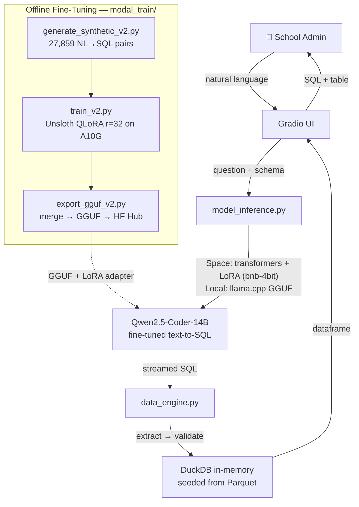

# 🏫 Kasualdad LFED

**Local-First Education Data** — ask questions about your district in plain English, get answers instantly. Designed so all inference can run on your own machine. No data ever leaves.

> 🏆 Built for the **HF Build Small Hackathon** (Chapter One: Backyard AI)

---

## Two Deployment Flavors

| | This Space (ZeroGPU) | Local-first (Mac/on-prem) |
|---|---|---|
| Inference | transformers + PEFT, bnb-4bit base + LoRA adapter | llama.cpp + GGUF (Metal/CPU) |
| Model | `unsloth/qwen2.5-coder-14b-instruct-bnb-4bit` + [`lfed-qwen2.5-coder-14b-sql-lora`](https://huggingface.co/build-small-hackathon/lfed-qwen2.5-coder-14b-sql-lora) | [`lfed-qwen2.5-coder-14b-sql-gguf`](https://huggingface.co/build-small-hackathon/lfed-qwen2.5-coder-14b-sql-gguf) (Q4_K_M) |
| Where | `main` branch | tag `local-llamacpp-v1` / `product` branch |
| Why | ZeroGPU's CUDA is PyTorch-only — llama.cpp can't use it (see `DEPLOY.md`) | Full local inference, zero cloud |

Both run the **same fine-tune**: QLoRA (r=32) on 27,859 NL→SQL pairs. The bnb-4bit + LoRA combination on the Space is the exact configuration the model was trained in.

---

## 🏅 Hackathon Badges

| Badge | Status | How |
|---|---|---|
| **Off the Grid** | ✅ | Local-first build runs entirely via llama.cpp + local GGUF. No API calls. No cloud. |
| **Well-Tuned** | ✅ | Fine-tuned Qwen2.5-Coder-14B on 27,859 synthetic NL→SQL pairs via Unsloth QLoRA on Modal A10G. |
| **Llama Champion** | ✅ | llama.cpp is the local inference backend (Q4_K_M GGUF, streaming generation). |
| **Off-Brand** | ✅ | Custom ResearchMono theme — IBM Plex Sans/Mono, IBM-blue accent, WCAG AA. |

---

## 🎯 What It Does

A school district admin (principal, superintendent, department head) types a question:

> *"What's the average GPA for chronically absent students vs non-chronic students in 2023-2024?"*

Kasualdad LFED:

1. Sends the question + schema context to the fine-tuned LLM
2. **Streams** the generated SQL into the UI token by token
3. Validates the SQL against the actual schema (read-only, column checks, forbidden tokens)
4. Executes it on an in-memory DuckDB seeded from deterministic Parquet files
5. Returns the results as a table

No API keys. No data exfiltration.

---

## 🏗 Architecture



---

## 📊 Data Schema

Deterministic seed data (committed as Parquet, byte-reproducible): **5 schools × 4 school years**, ~2,900 students, 15% chronic absenteeism, 178K total rows across 5 tables.

### `enrollment`
| Column | Type |
|---|---|
| `school_year` | VARCHAR (`'YYYY-YYYY'`) |
| `school_name` | VARCHAR |
| `grade_level` | INTEGER (K=0 … 12) |
| `student_count` | INTEGER |

### `attendance`
| Column | Type |
|---|---|
| `student_id` | INTEGER |
| `school_name` | VARCHAR |
| `school_year` | VARCHAR |
| `absence_count` | INTEGER |
| `is_chronically_absent` | BOOLEAN (≥10% of school days missed) |

### `students`
| Column | Type |
|---|---|
| `student_id` | INTEGER |
| `school_name` | VARCHAR |
| `grade_level` | INTEGER |
| `gender`, `race_ethnicity` | VARCHAR |
| `english_learner`, `special_education`, `economically_disadvantaged` | BOOLEAN |

### `discipline`
| Column | Type |
|---|---|
| `incident_id`, `student_id` | INTEGER |
| `school_name`, `school_year` | VARCHAR |
| `grade_level` | INTEGER |
| `incident_type`, `severity`, `action_taken` | VARCHAR |
| `incident_date` | DATE |
| `days_suspended` | INTEGER |

### `grades`
| Column | Type |
|---|---|
| `student_id` | INTEGER |
| `school_name`, `school_year` | VARCHAR |
| `grade_level` | INTEGER |
| `course_name`, `term`, `letter_grade` | VARCHAR |
| `grade_numeric`, `gpa` | DOUBLE |

### Schools
| School | Grades |
|---|---|
| Lincoln Elementary | K–5 |
| Washington Middle | 6–8 |
| Jefferson High | 9–12 |
| Roosevelt Academy | K–8 |
| Kennedy Prep | 6–12 |

---

## 🚀 How to Run

### On this Space
Nothing to do — ask a question or click an example chip. First query after a cold start takes longer (ZeroGPU attaches a GPU and restores ~10.5 GB of packed weights).

### Locally (the local-first version)

The `main` branch targets CUDA (bitsandbytes requires it). For Mac/CPU local use, start from the llama.cpp version:

```bash
git checkout -b product local-llamacpp-v1   # or: git checkout product

python3.12 -m venv .venv && source .venv/bin/activate
pip install -r requirements.txt             # includes llama-cpp-python (Metal on macOS)

python app.py                                # downloads the GGUF on first run
```

Open **http://localhost:7860**.

---

## 🔧 Fine-Tuning Pipeline (v2)

The Modal training pipeline lives in `modal_train/`:

```bash
pip install modal
modal secret create huggingface-secret HF_TOKEN=hf_your_token_here
modal run modal_train/modal_train_v2.py     # QLoRA train → merge → GGUF → push
```

| Script | What it does |
|---|---|
| `generate_synthetic_v2.py` | Builds the 27,859-pair NL→SQL dataset (templates + Gretel + rephrasing) |
| `train_v2.py` | Unsloth QLoRA on Qwen2.5-Coder-14B (r=32, α=32, 4-bit, 2 epochs, lr=1e-4, A10G) |
| `export_gguf_v2.py` | Merges LoRA → GGUF Q4_K_M → pushes to HF Hub |
| `modal_train_v2.py` | Modal orchestration; adapter persisted to the `lfed-training-data` volume |

Published artifacts:
- LoRA adapter: [`build-small-hackathon/lfed-qwen2.5-coder-14b-sql-lora`](https://huggingface.co/build-small-hackathon/lfed-qwen2.5-coder-14b-sql-lora)
- GGUF: [`build-small-hackathon/lfed-qwen2.5-coder-14b-sql-gguf`](https://huggingface.co/build-small-hackathon/lfed-qwen2.5-coder-14b-sql-gguf)

---

## 🧪 Tests

```bash
pytest tests/ -v
```

81 tests covering the execution guard (SQL injection, forbidden tokens, schema validation), data engine (isolation, seed integrity, timeout), and model inference (prompt assembly, streaming, singleton caching, JSON parsing). Model calls are mocked — the suite runs anywhere in ~1s.

---

## 📁 Project Structure

```
Kasualdad_LFED/
├── app.py                   # Gradio UI (thin controller, streaming, @spaces.GPU)
├── prompts.py               # System prompt, 5-table schema docs, 4 few-shot examples
├── model_inference.py       # transformers + PEFT wrapper (llama.cpp-compatible API)
├── data_engine.py           # DuckDB lifecycle, execution guard, timeout
├── data/
│   ├── generate_seed.py     # Deterministic seed generator (5 tables)
│   ├── export_parquet.py    # Seed → Parquet exporter
│   └── *.parquet            # 5 committed seed files (LFS, ~260 KB total)
├── tests/                   # 81 pytest tests
├── modal_train/             # v2 fine-tuning pipeline (Modal + Unsloth)
├── docs/
│   ├── SPEC_query-history-dashboards.md   # Next feature spec (draft)
│   └── …                    # plans, handoff, training playbook
├── DEPLOY.md                # ZeroGPU deployment war story + resolution
├── requirements.txt
└── README.md
```

Branches & tags:
- `main` — this Space (transformers + LoRA on ZeroGPU)
- `local-llamacpp-v1` (tag) / `product` (branch) — the llama.cpp local-first base

---

## Design (Off-Brand)

**ResearchMono** theme built on `gr.themes.Soft`:

| Token | Value | Usage |
|---|---|---|
| Background | `#F2F4F8` (light) / `#121619` (dark) | Page |
| Surface | `#ffffff` | Cards, inputs |
| Text | `#21272A` | Primary text |
| Accent | `#4589FF` (IBM blue) | Primary actions, links |
| Accent hover | `#2C6FDD` | Button hover |
| Border | `#DDE1E6` | Subtle borders |

- **Typography:** IBM Plex Sans (UI) + IBM Plex Mono (SQL/code)
- **Layout:** Two-column — question, status & example chips left; streamed SQL + results right
- **Accessibility:** WCAG AA contrast, `:focus-visible` rings, `prefers-reduced-motion` support, color never the sole state indicator

---

## 📝 License

Apache 2.0
